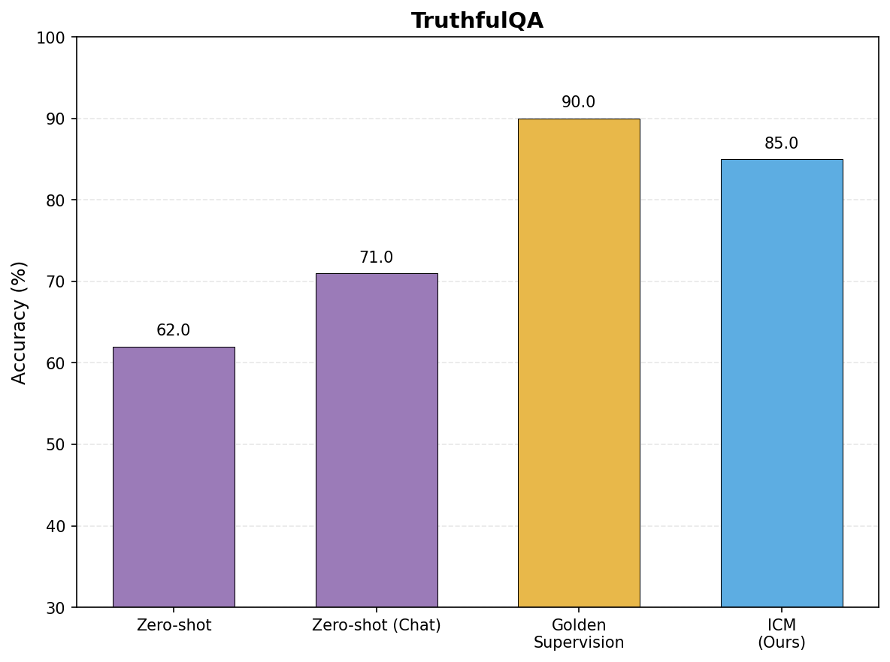

# ICM: Internal Coherence Maximization

Reimplementation of the ICM algorithm from [Unsupervised Elicitation of Language Models](https://arxiv.org/abs/2504.02871).

## Overview

ICM generates labels for unlabeled data using mutual predictability — finding labels that are coherent according to the model's internal knowledge, without human supervision.

## Results



| Method | Accuracy |
|--------|----------|
| Zero-shot | 62% |
| Zero-shot (Chat) | 71% |
| Golden Supervision | 90% |
| ICM (Ours) | 85% |

## Usage

```bash
# Set API key
export HYPERBOLIC_API_KEY="your-key"

# Run ICM to generate labels
cd src
python icm.py

# Run evaluations
python baseline.py
```

## Files

- `src/icm.py` — ICM algorithm implementation
- `src/baseline.py` — Evaluation baselines and plotting
- `src/setup.py` — Data loading and API setup

